# Цель работы

Основная цель работы — изучить несколько структур данных, реализованных в Julia, и научиться применять их для решения задач.

---

# Задание

1. Используя Jupyter Lab, повторить примеры.
2. Выполнить задания для самостоятельной работы.

---

# Теоретическое введение

Julia — высокоуровневый язык программирования с динамической типизацией, предназначенный для математических вычислений.

Использовалась официальная документация Julia.

---

# Основные функции структур данных

- `isempty()` — проверка на пустоту  
- `length()` — длина структуры  
- `in()` — проверка принадлежности  
- `unique()` — уникальные элементы  
- `reduce()` — свёртка структуры  
- `maximum()` / `minimum()` — поиск экстума  

---

# Кортежи

Выполнение примеров из раздела про кортежи:

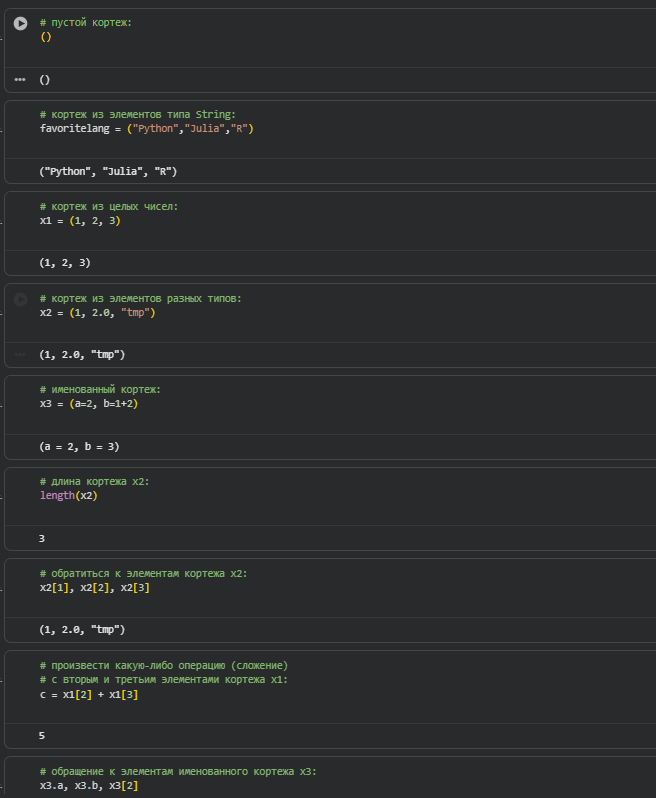

---
# Словари

Примеры использования словарей:

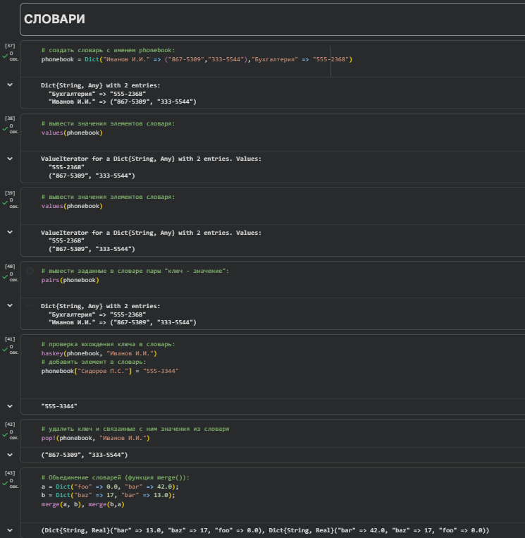

---
# Множества

Выполнение примеров работы с множествами:

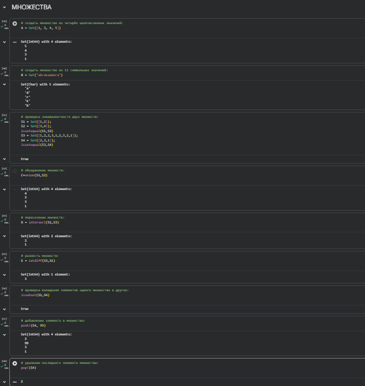

---
# Массивы (часть 1)

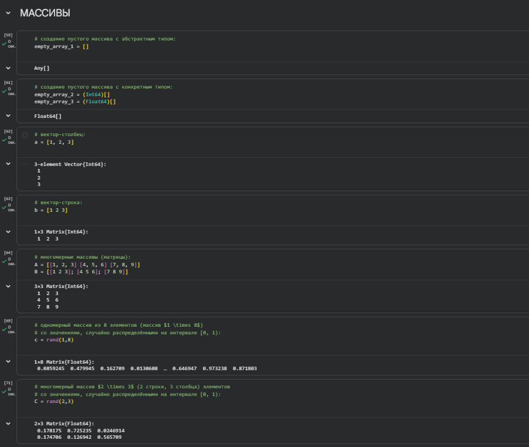

---

# Массивы (часть 2)

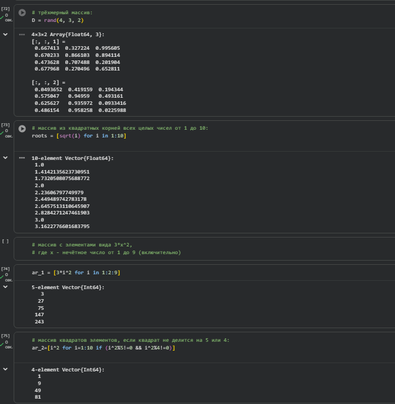

---

# Массивы (часть 3)

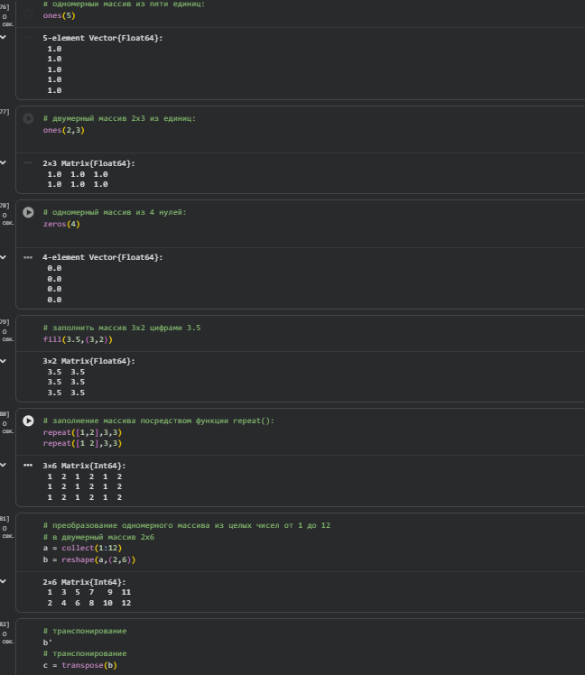

---

# Массивы (часть 4)

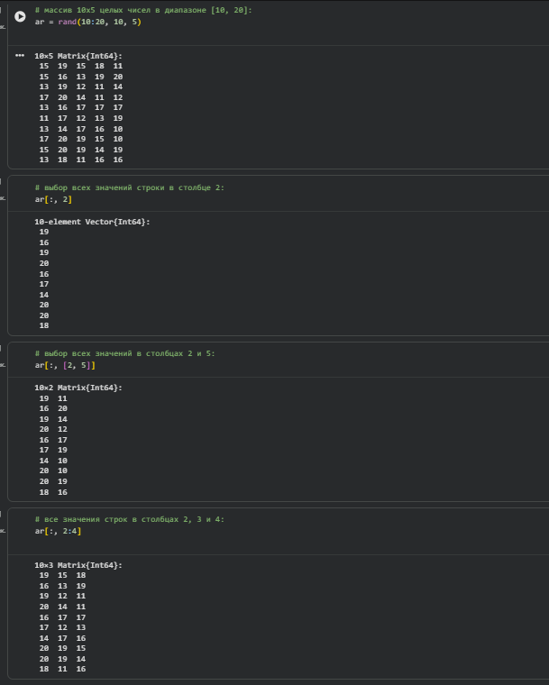

---

# Массивы (часть 5)

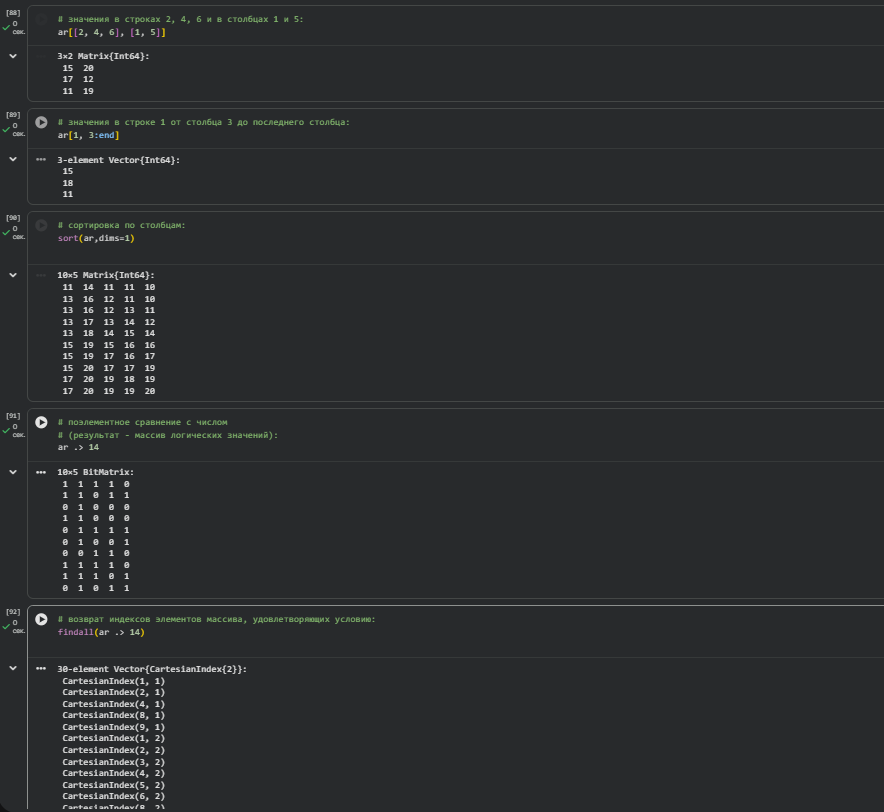

---
# Задание №1

Даны множества:

A = {0, 3, 4, 9}  
B = {1, 3, 4, 7}  
C = {0, 1, 2, 4, 7, 8, 9}  

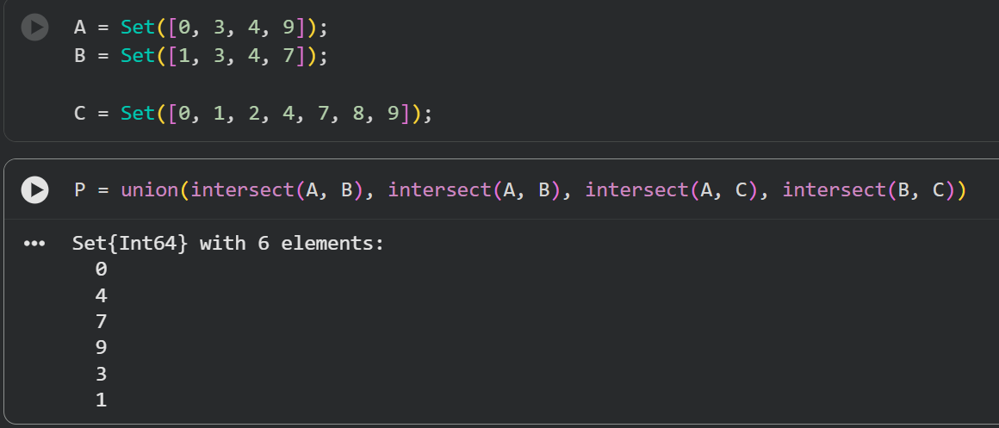

---

# Задание №2

Операции над множествами элементов разных типов:

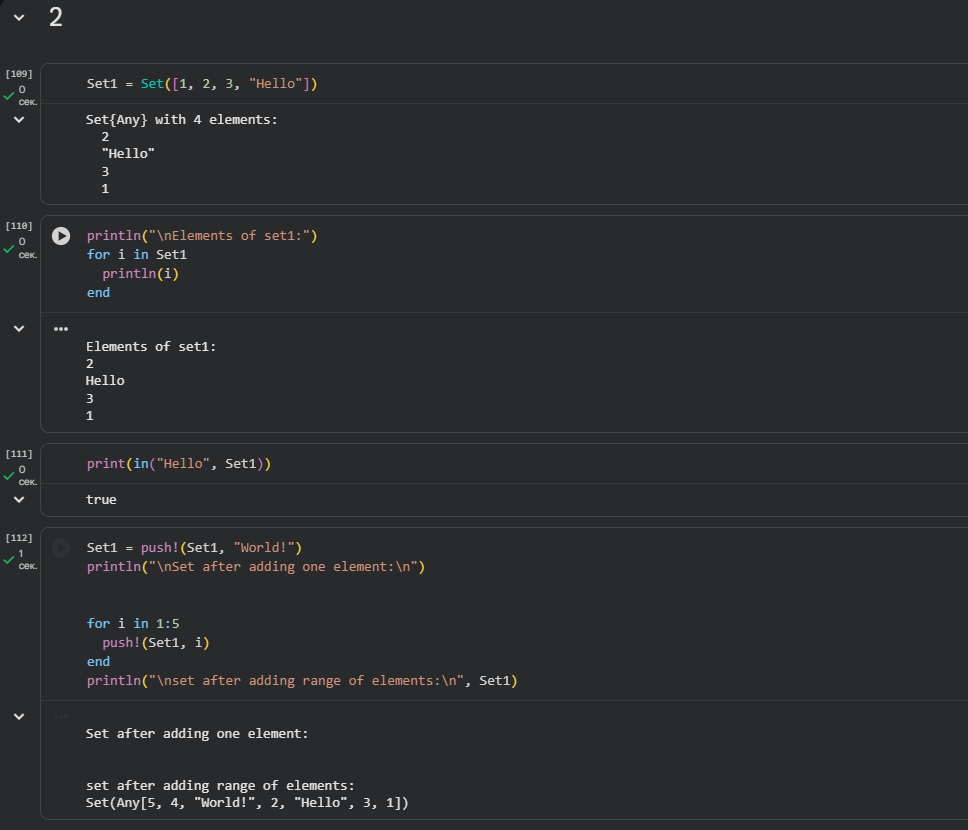

---

# Задание №3 (часть 1)

Создание массивов различными способами:

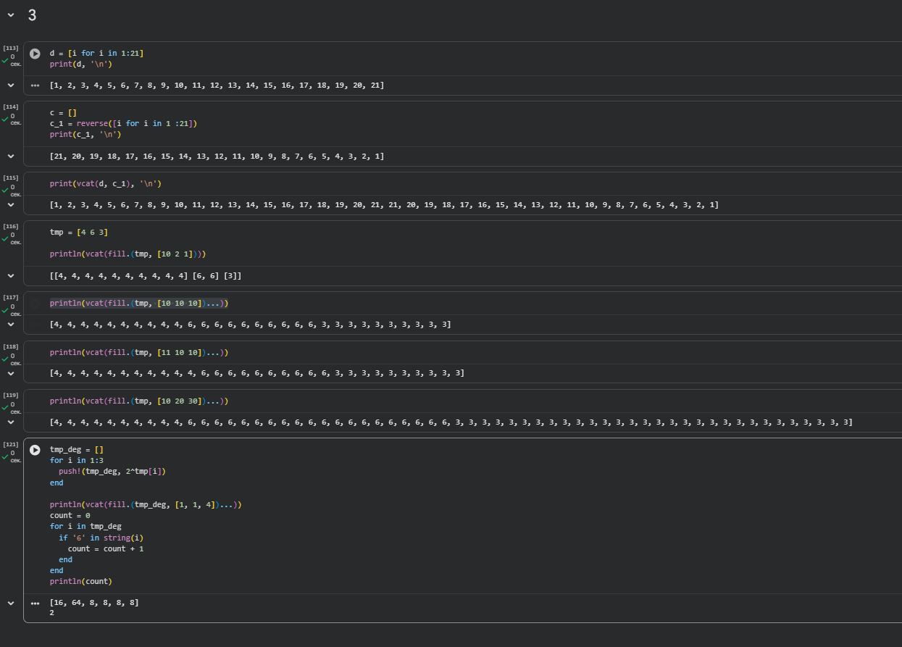

---

# Задание №3 (часть 2)

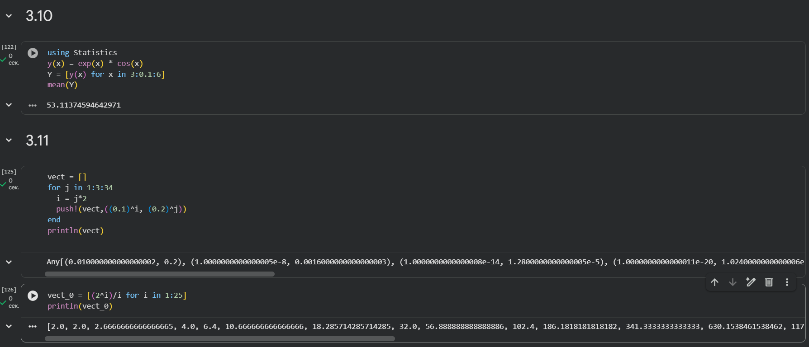

---

# Задание №3 (часть 3)

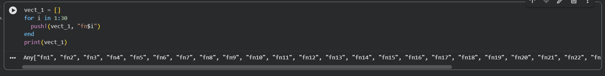

---

# Задание №3 (часть 4)

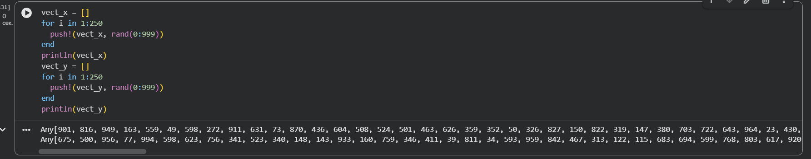

---

# Задание №3 (часть 5)

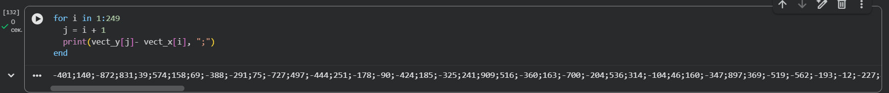

---

# Задание №4

Массив `squares` — квадраты чисел от 1 до 100:

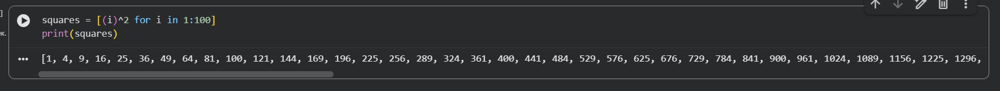

---

# Задание №5

Работа с пакетом `Primes`:

- Генерация первых 168 простых чисел  
- Поиск 89-го простого числа  
- Получение среза массива  

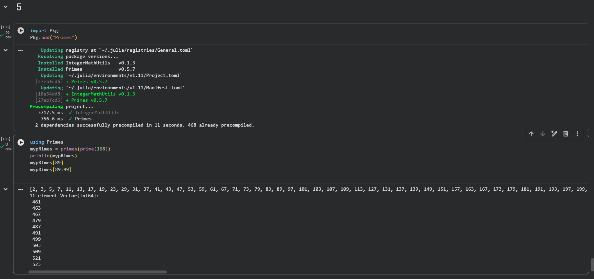

---
# Задание №6 (часть 1)

Вычисление суммы:

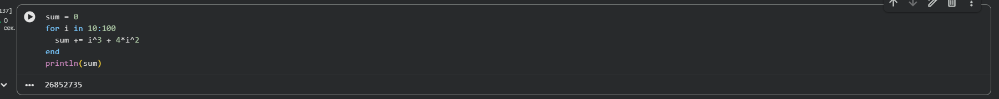

---

# Задание №6 (часть 2)

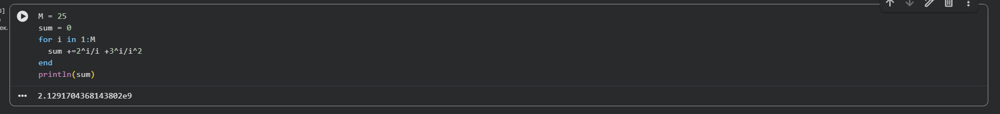

---

# Задание №6 (часть 3)

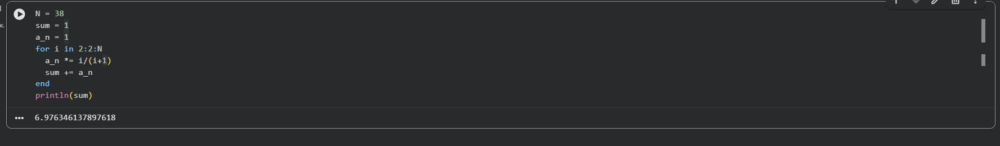

---

# Выводы

В ходе лабораторной работы:

- Изучены структуры данных в Julia  
- Освоены операции над кортежами, словарями, множествами и массивами  
- Получены навыки решения практических задач средствами Julia  
