# Цель работы

Освоить применение:

- циклов  
- условных операторов  
- функций  
- сторонних пакетов Julia  

для решения задач линейной алгебры и работы с матрицами.

---

# Задание

1. Повторить примеры из раздела 3.2  
2. Выполнить задания для самостоятельной работы (раздел 3.4)

---

# Теоретическое введение

Julia — высокоуровневый язык программирования с динамической типизацией, предназначенный для математических вычислений.

Использовалась официальная документация Julia.

---

# Примеры: циклы

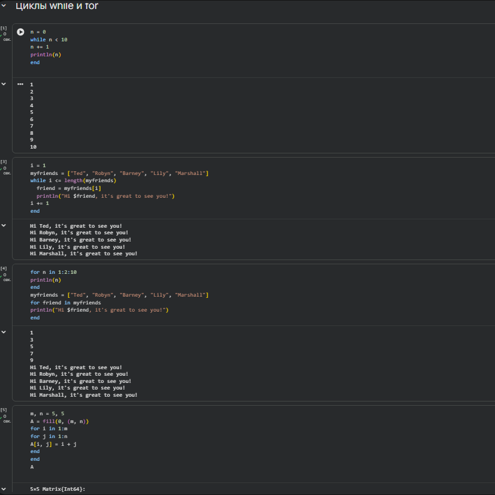

---

# Примеры: условные выражения

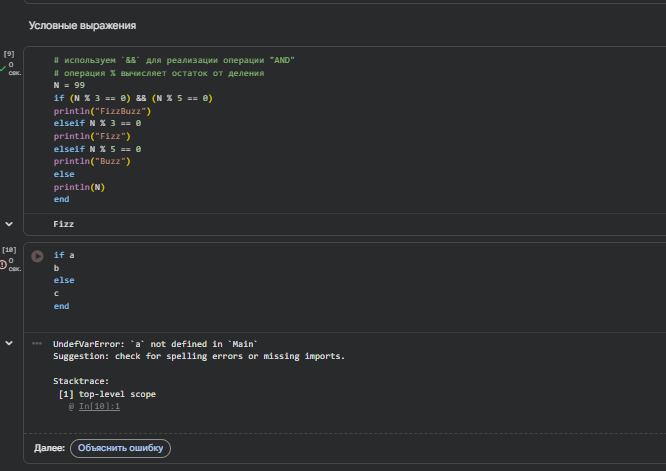

---

# Примеры: функции

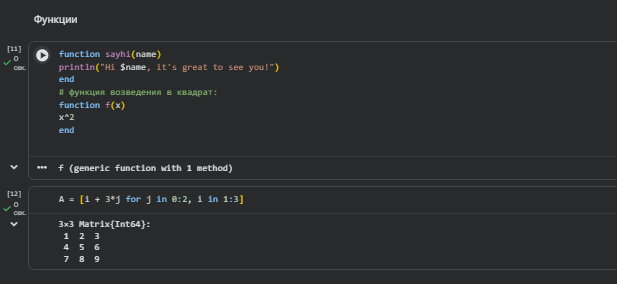

---

# Примеры: сторонние библиотеки

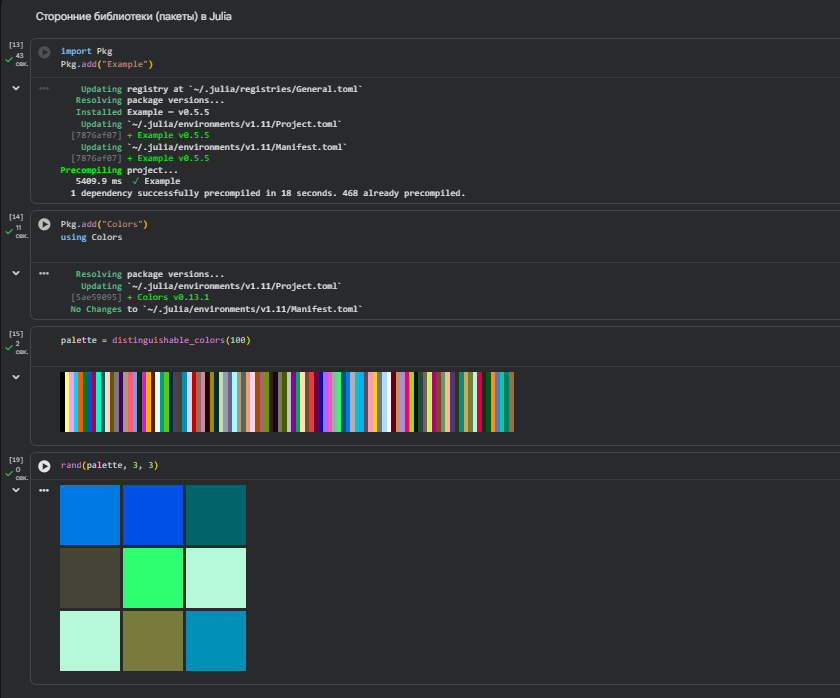

---

# Задание №1

Использование циклов `while` и `for`.

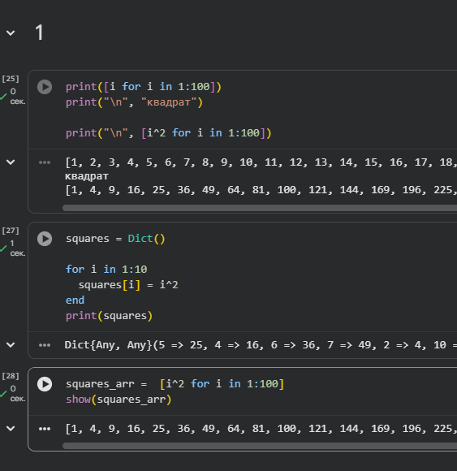

---

# Задание №2

Условный оператор:

- если число чётное — вывести число  
- если нечётное — вывести строку "нечётное"  

Переписано с использованием тернарного оператора.

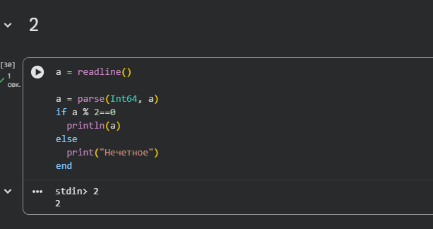

---

# Задание №3

Функция `add_one`, увеличивающая входное значение на 1.

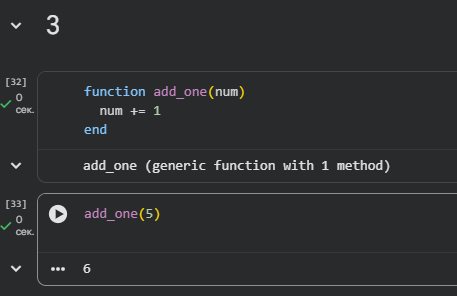

---

# Задание №4

Использование `map()` или `broadcast()`  
для создания матрицы A с последовательным увеличением элементов.

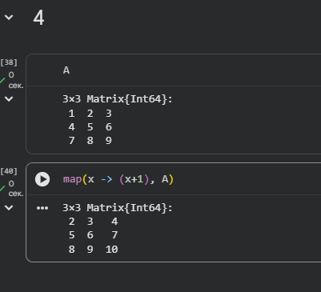

---

# Задание №5

- Задана матрица A  
- Найдено \( A^3 \)  
- Третий столбец заменён суммой второго и третьего  

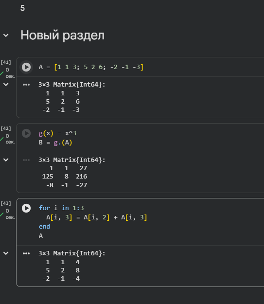

---

# Задание №6

Матрица B:

\[
B_{i1}=10,\quad B_{i2}=-10,\quad B_{i3}=10
\]

Вычислена матрица:

\[
C = B^T B
\]

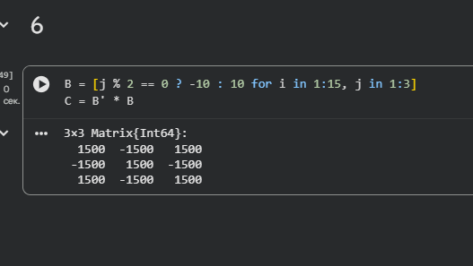

---

# Задание №7

Созданы матрицы:

- \( Z \) — нулевая 6×6  
- \( E \) — единичная 6×6  

Построены требуемые матрицы с использованием циклов.

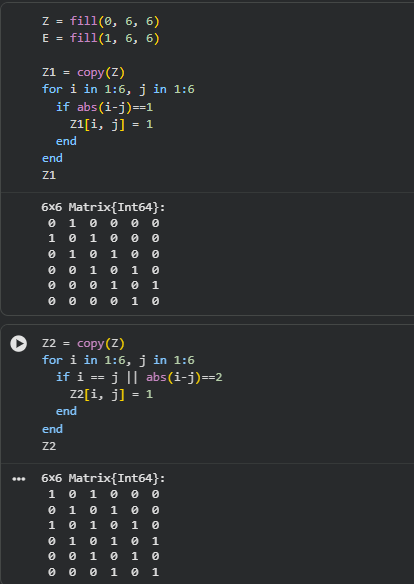

---

# Задание №8

Реализация функции `outer()` и проверка её работы.

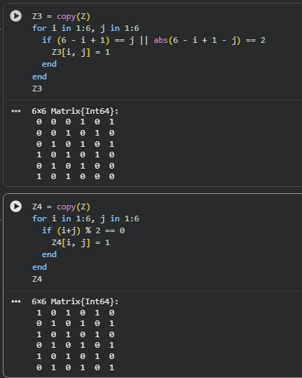

---

# Задание №10–11

Анализ количества элементов матрицы,  
удовлетворяющих заданным условиям.  

Вычисление выражений.

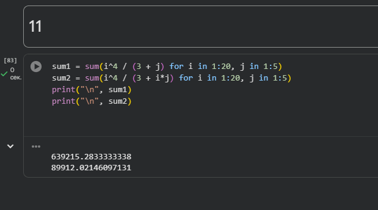

---

# Выводы

В ходе лабораторной работы:

- Освоено применение циклов и функций в Julia  
- Изучена работа с матрицами  
- Получены навыки использования сторонних библиотек  
- Закреплены методы решения задач линейной алгебры  
