# Цель работы

Изучение возможностей специализированных пакетов Julia для выполнения и оценки эффективности операций над объектами линейной алгебры.

---

# Задание

1. Используя JupyterLab, повторить примеры  
2. Выполнить задания для самостоятельной работы

---

# Теоретическое введение

Julia — высокоуровневый язык с динамической типизацией, предназначенный для математических вычислений.  

Синтаксис языка близок к другим математическим языкам, но имеет отличия.  

Использовалась официальная документация Julia.

---

# Примеры: поэлементные операции над массивами

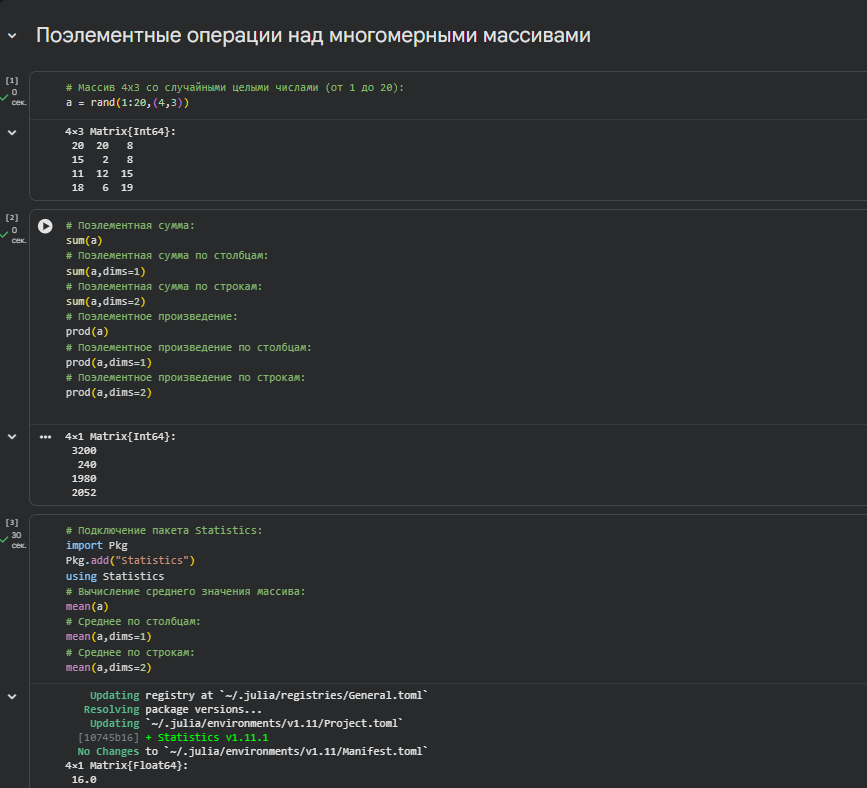

---

# Примеры: транспонирование, след, ранг, определитель, инверсия

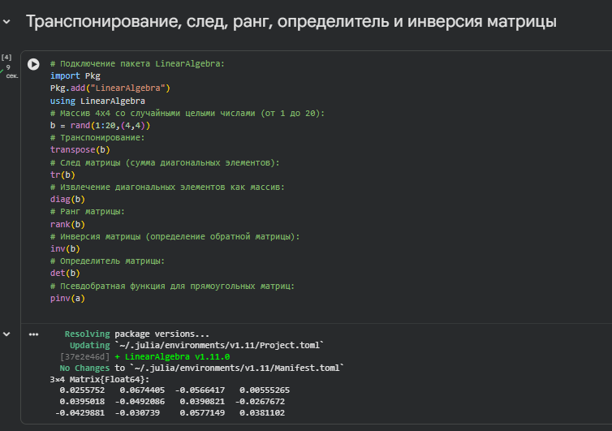

---

# Примеры: нормы, повороты, вращения

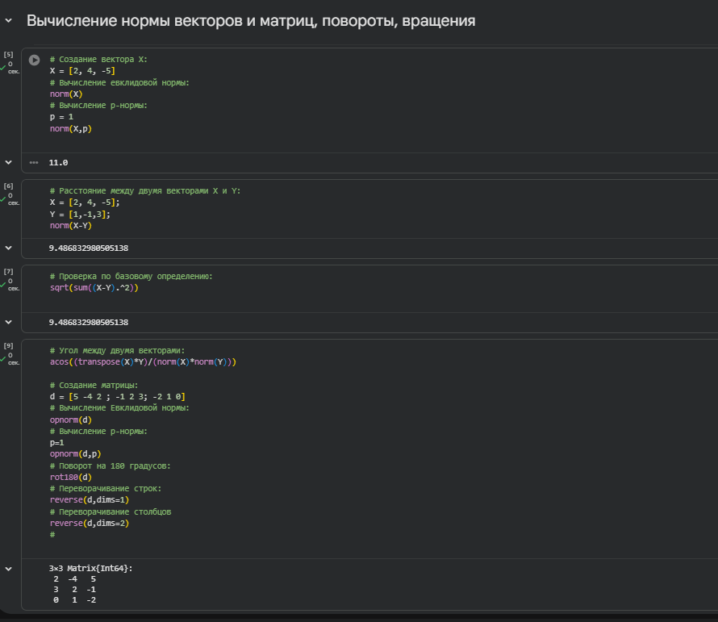

---

# Примеры: матричное умножение, единичная матрица, скалярное произведение

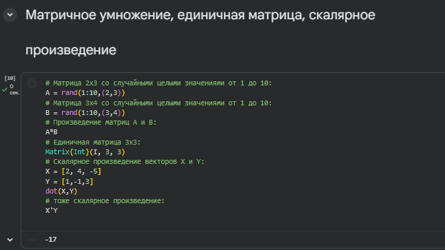

---

# Примеры: факторизация и специальные матричные структуры

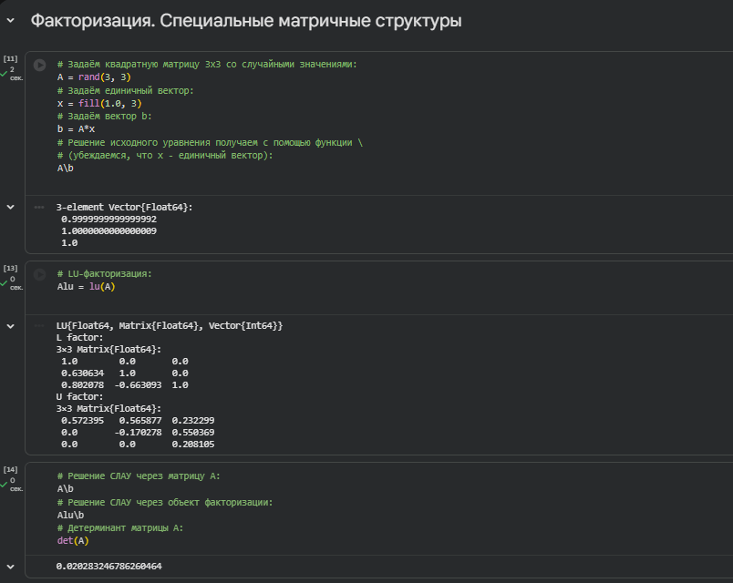
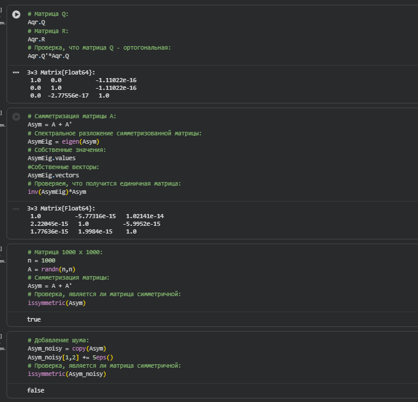
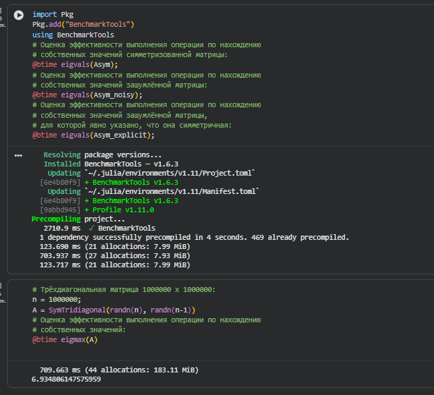
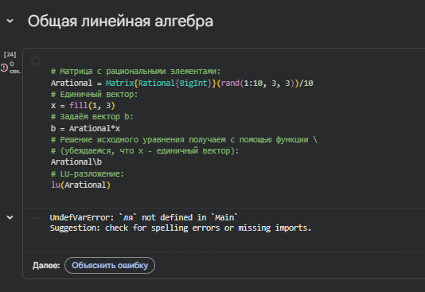

---

# Задание №1: Произведение векторов

- Задаём вектор `v`  
- Скаларное произведение: `dot_v`  
- Внешнее произведение: `outer_v`

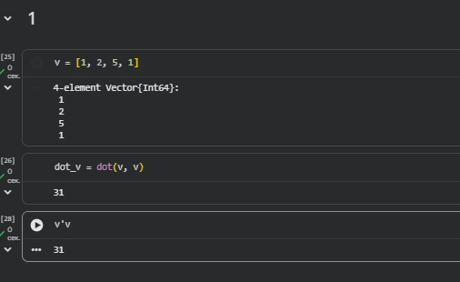

---

# Задание №2: Системы линейных уравнений

- Решение СЛАУ с двумя неизвестными

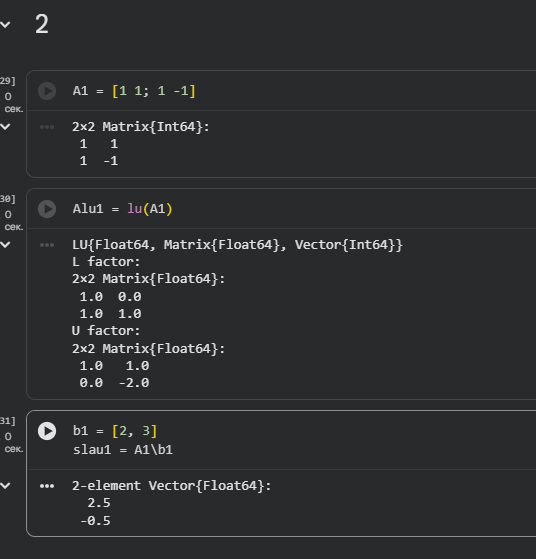
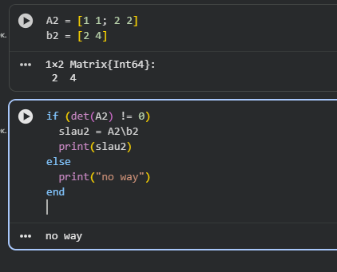
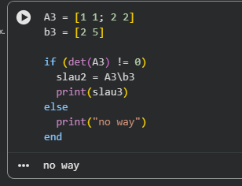
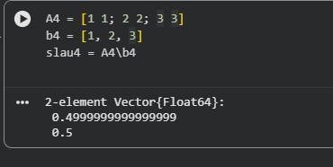

- Решение СЛАУ с тремя неизвестными

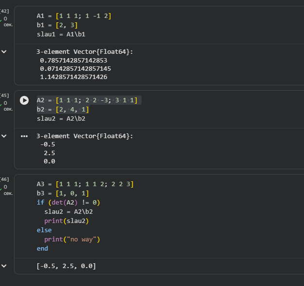

---

# Задание №3: Операции с матрицами

- Приведение к диагональному виду

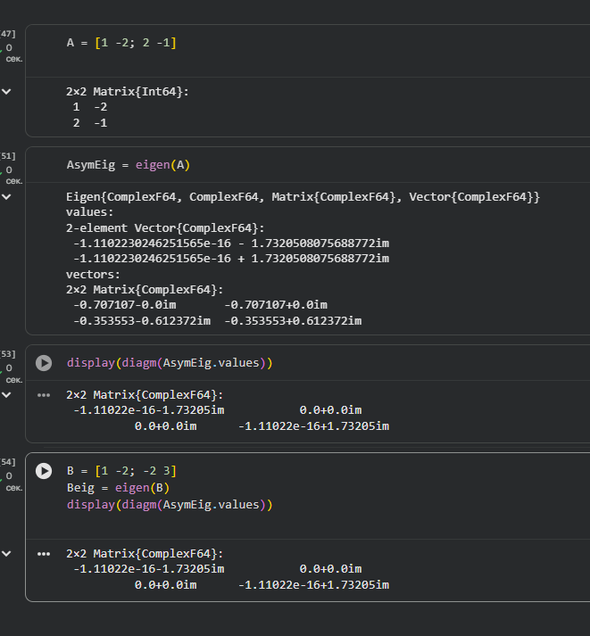

- Вычисления

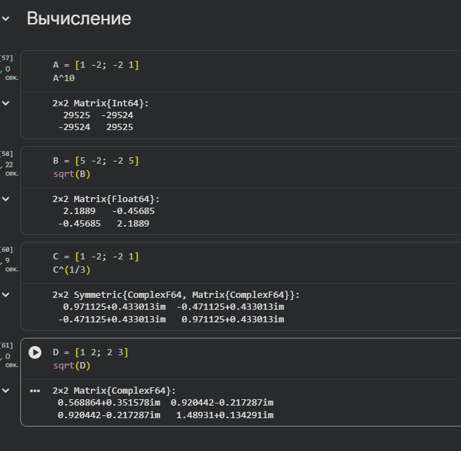

- Собственные значения, диагональная и нижнедиагональная матрицы

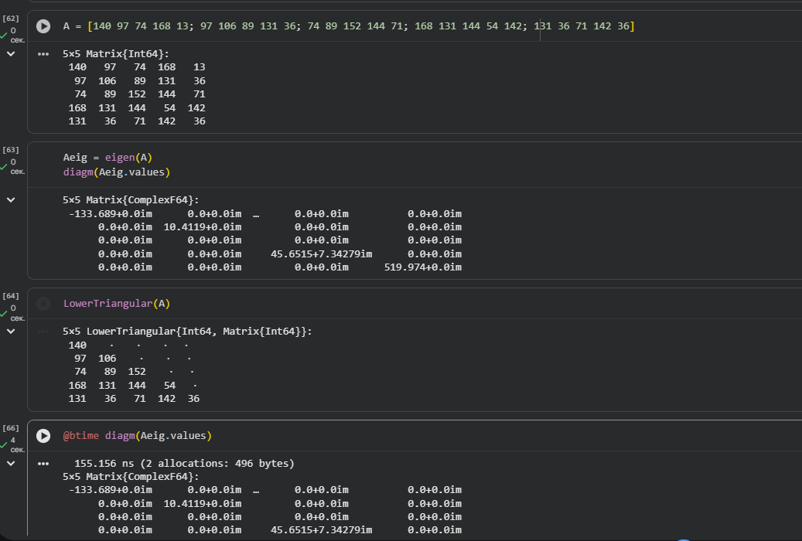

---

# Задание №4: Линейные модели экономики

- Линейная модель: \( x - Ax = y \)  
- Проверка продуктивности матриц  
- Критерий: элементы \((E-A)^{-1}\) ≥ 0

---

# Выводы

В ходе работы:

- Изучены специализированные пакеты Julia  
- Выполнены операции линейной алгебры и матричные вычисления  
- Оценена эффективность операций с объектами линейной алгебры  
