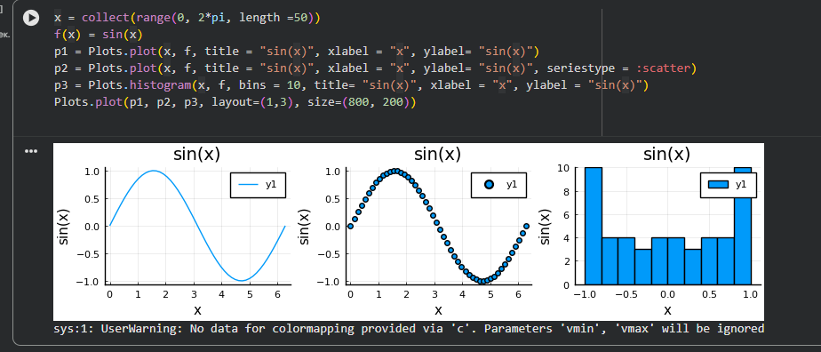
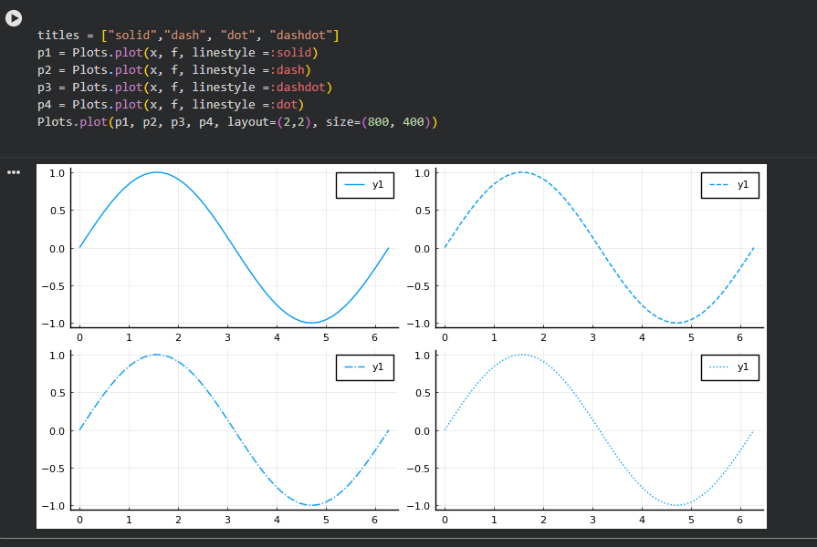
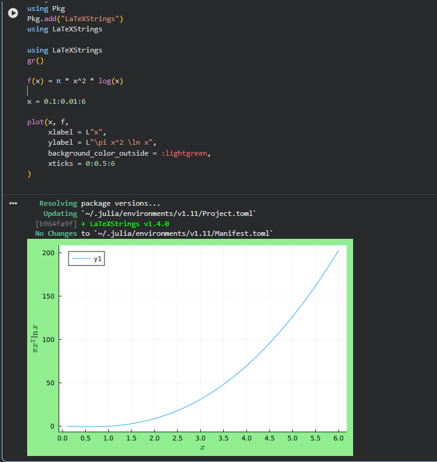
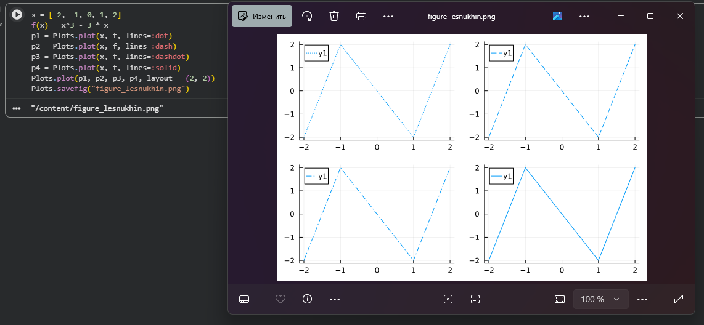
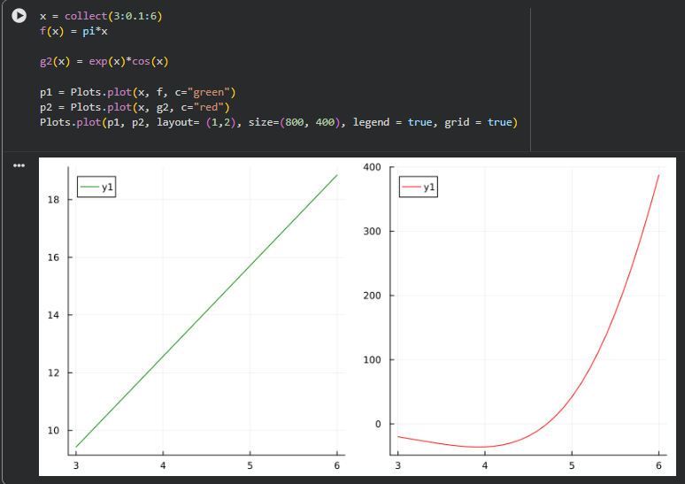
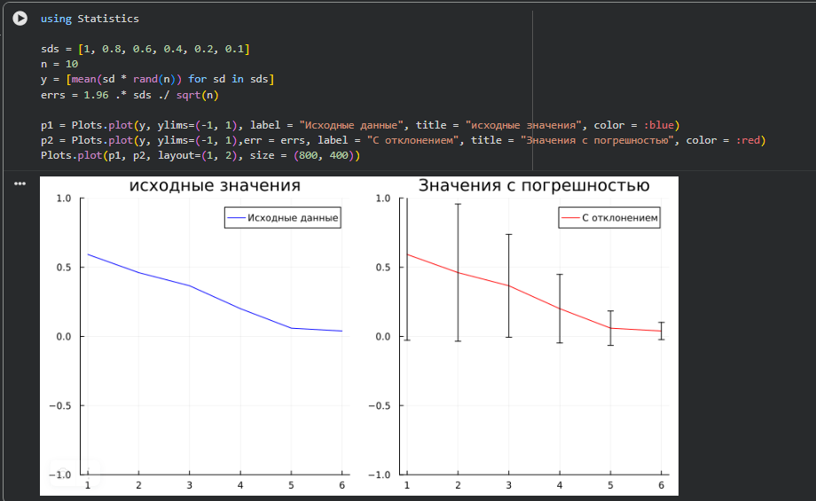
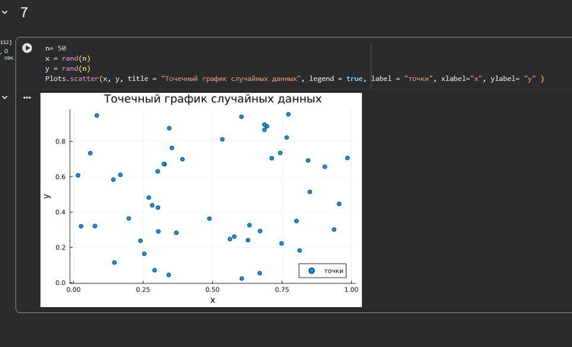
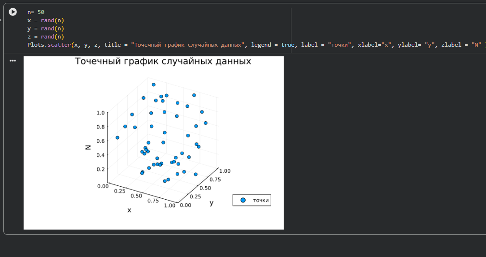
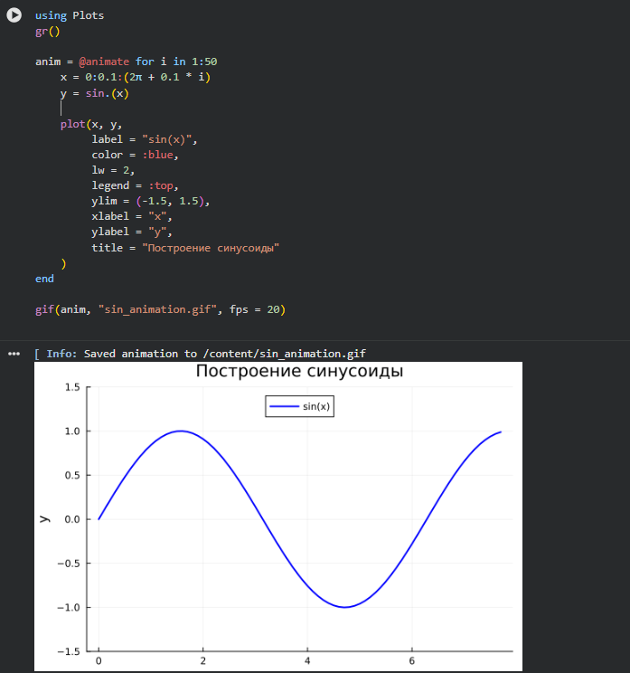
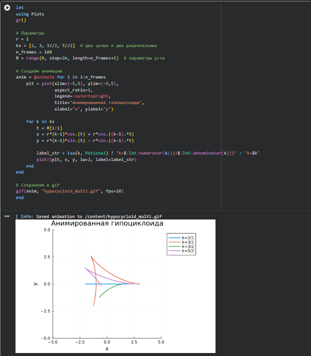

# Цель работы

Основная цель работы -- освоить синтаксис языка Julia для построения графиков.

# Задание

1. Используя JupyterLab, повторите примерыи. При этом дополните графики обозначениями осей координат, легендой с названиями траекторий, названиями графиков и т.п.

2. Выполните задания для самостоятельной работы.

# Теоретическое введение

Julia -- высокоуровневый свободный язык программирования с динамической типизацией, созданный для математических вычислений [@julialang]. Эффективен также и для написания программ общего назначения. Синтаксис языка схож с синтаксисом других математических языков, однако имеет некоторые существенные отличия.

Для выполнения заданий была использована официальная документация Julia [@juliadoc].

# Выполнение лабораторной работы

## Задания для самостоятельной работы

ЗАДАНИЕ №1

Постройте все возможные типы графиков (простые, точечные, гистограммы и т.д.) функции Y = SIN(X), x = 0,2p. Отобразите все графики в одном графическом окне
.

Задание 2 

Постройте  графики функции Y = SIN(X), x = 0,2p Отобразите все графики в одном графическом окне.

Задание 3

Задание 4

Задание 5

Задание 6

Задание 7

Задание 8

Задание 9

Задание 10

# Выводы

В результате выполнения данной лабораторной работы я освоил синтаксис языка Julia для построения графиков.
