# Цель работы

Основной целью работы является освоение специализированных пакетов для решения задач в непрерывном и дискретном времени.

# Задание

1. Используя JupyterLab, повторите примерыи. При этом дополните графики обозначениями осей координат, легендой с названиями траекторий, названиями графиков и т.п.

2. Выполните задания для самостоятельной работы.

# Теоретическое введение

Julia -- высокоуровневый свободный язык программирования с динамической типизацией, созданный для математических вычислений [@julialang]. Эффективен также и для написания программ общего назначения. Синтаксис языка схож с синтаксисом других математических языков, однако имеет некоторые существенные отличия.

Для выполнения заданий была использована официальная документация Julia [@juliadoc].

# Выполнение лабораторной работы

## Задания для самостоятельной работы

1. Реализуем и проанализируем модель роста численности изолированной популяции(модель Мальтуса):

$$
\dot x = ax, \quad a = b - c,
$$
где $x(t)$ -- численность изолированной популяции в момент времени $t$,$a$ -- коэффициент роста популяции, $b$ -- коэффициент рождаемости, $c$ -- коэффициент смертности. Построим соответствующие графики (в том числе с анимацией)

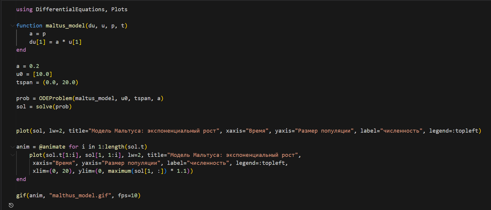

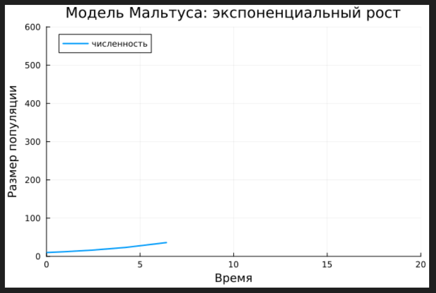

2. Реализуем и проанализируем логистическую модель роста популяции:

$$
\dot x = rx(1 - \dfrac{x}{k}), \quad r>0, \quad k>0,
$$

где $r$ -- коэффициент роста популяции, $k$ -- потенциальная ёмкость экологической системы (предельное значение численности популяции).
Построим соответствующие графики (в том числе с анимацией)

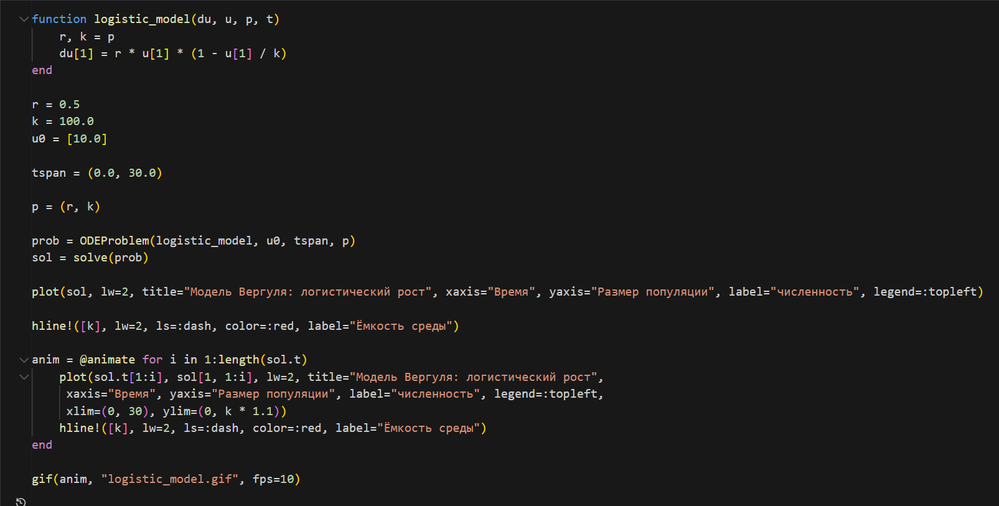

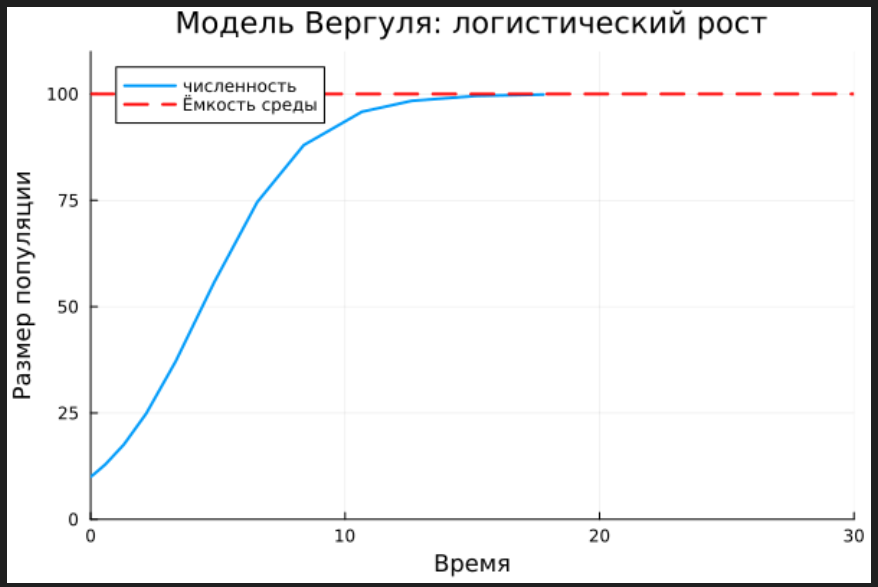

3. Реализуем и проанализируем логистическую модель эпидемии Кермака–Маккендрика (SIR-модель):

$$
\begin{cases}
\dot S = - \beta I S, \\
\dot I = \beta I S - \gamma I, \\
\dot R = \gamma I,
\end{cases}
$$

где $S$ -- численность восприимчивой популяции, $I$ -- численность инфицированных, $R$ -- численность удаленной популяции (в результате смерти или выздоровления), и $N$ — это сумма этих трёх, а $\beta$ и $\gamma$ - это коэффициенты заболеваемости и выздоровления соответственно

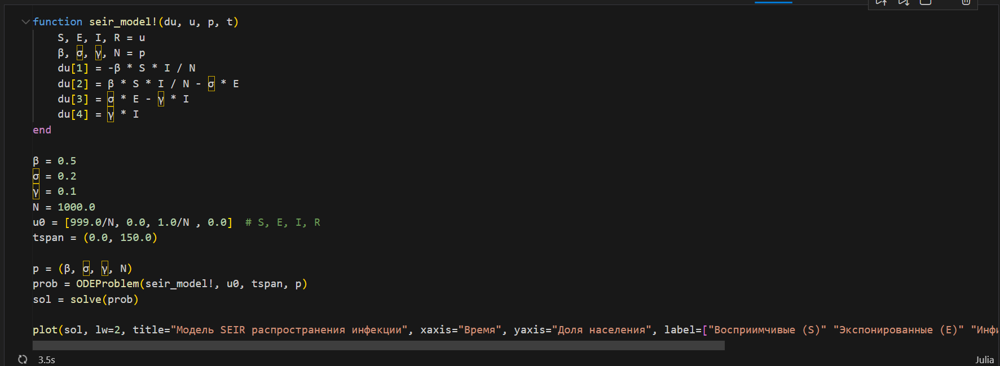
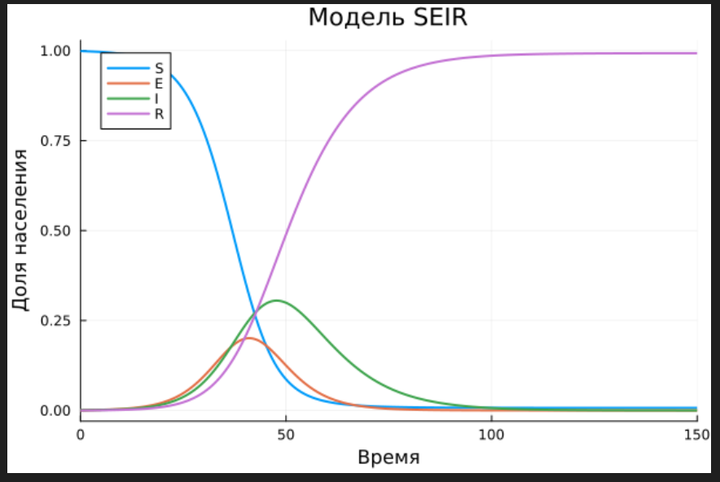

5. Для дискретной модели Лотки–Вольтерры:

$$
\begin{cases}
X_1(t+1) = a X_1(t)(1-X_1(t)) - X_1(t) X_2(t), \\
X_2(t+1) = -c X_2(t) - d X_1(t) X_2(t).
\end{cases}
$$

с начальными данными $a = 2, c = 1, d = 5$ найдем точку равновесия. Получим и сравним аналитическое и численное решения

$$
\begin{cases}
\dot S = - \dfrac{\beta}{N} I S, \\
\dot E = \dfrac{\beta}{N} I S - \delta E, \\
\dot I = \delta E - \gamma I, \\
\dot R = \gamma I,
\end{cases}
$$

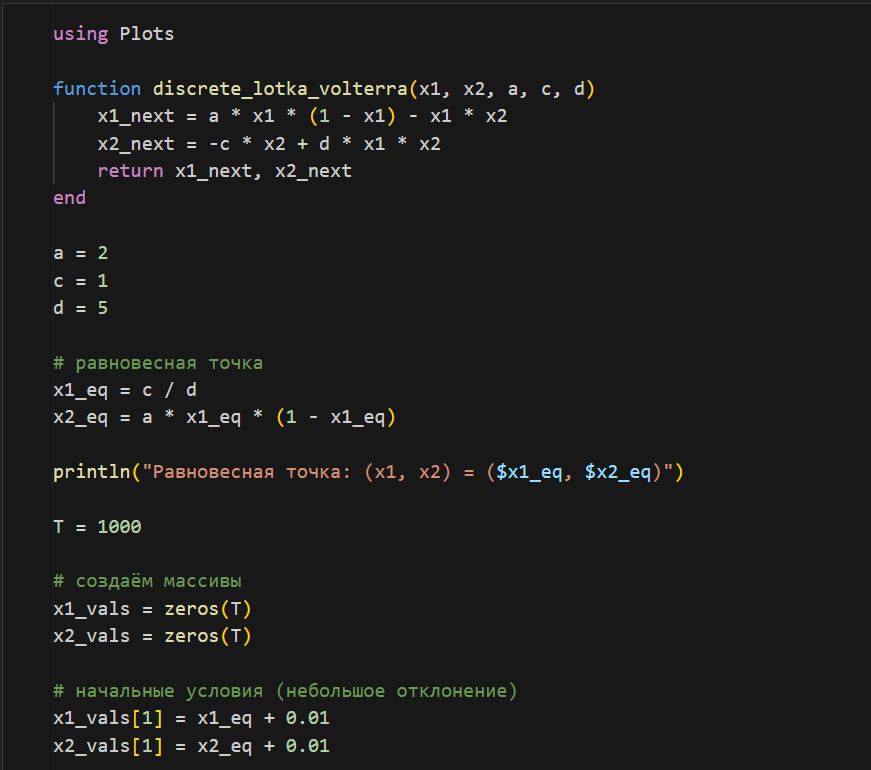
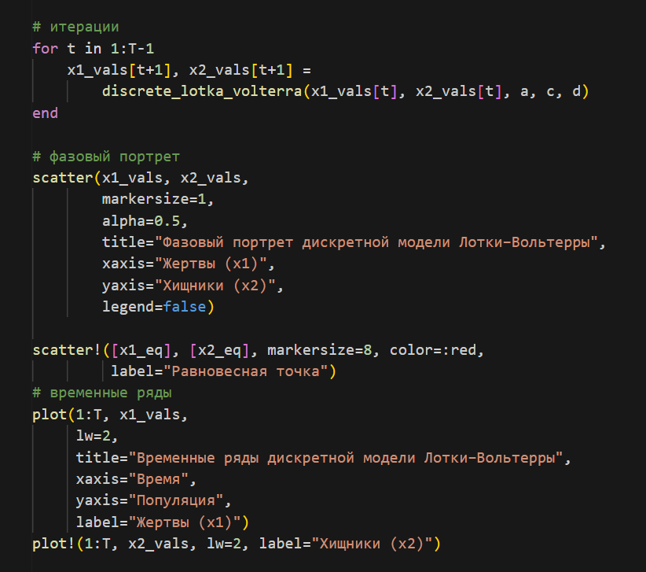
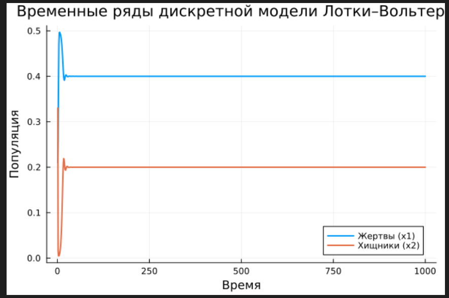

6. Реализуем на языке Julia модель отбора на основе конкурентных отношений:

$$
\begin{cases}
\dot x = \alpha x - \beta xy, \\
\dot y = \alpha y - \beta xy,
\end{cases}
$$

Построим соответствующие графики (в том числе с анимацией) и фазовый портрет

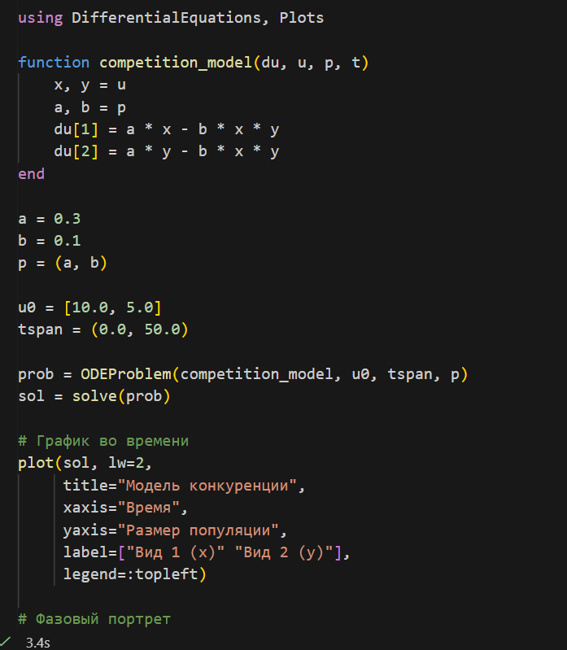
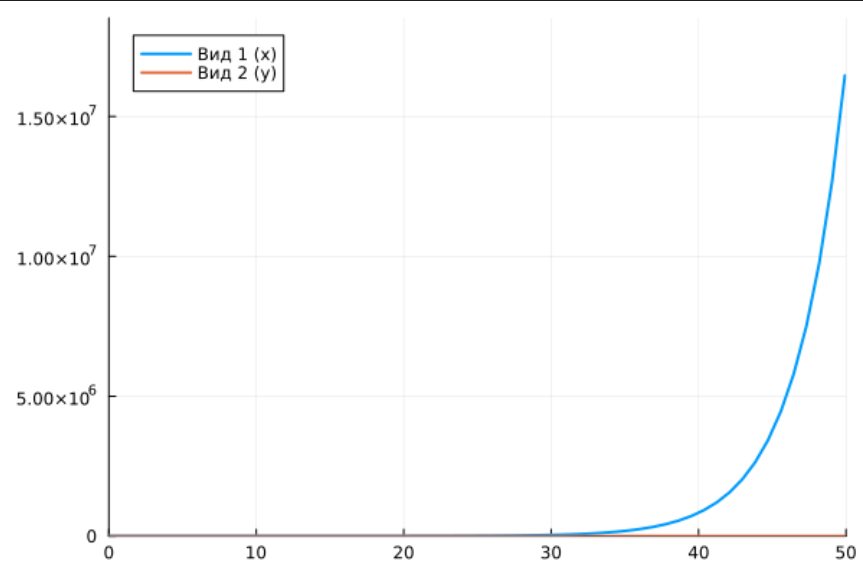

7. Реализуем на языке Julia модель консервативного гармонического осциллятора:

$$
\ddot x + \omega _0 ^2 = 0, x(t_0) = x_0, \dot x(t_0) = y_0.
$$

Построим соответствующие графики (в том числе с анимацией) и фазовый портрет

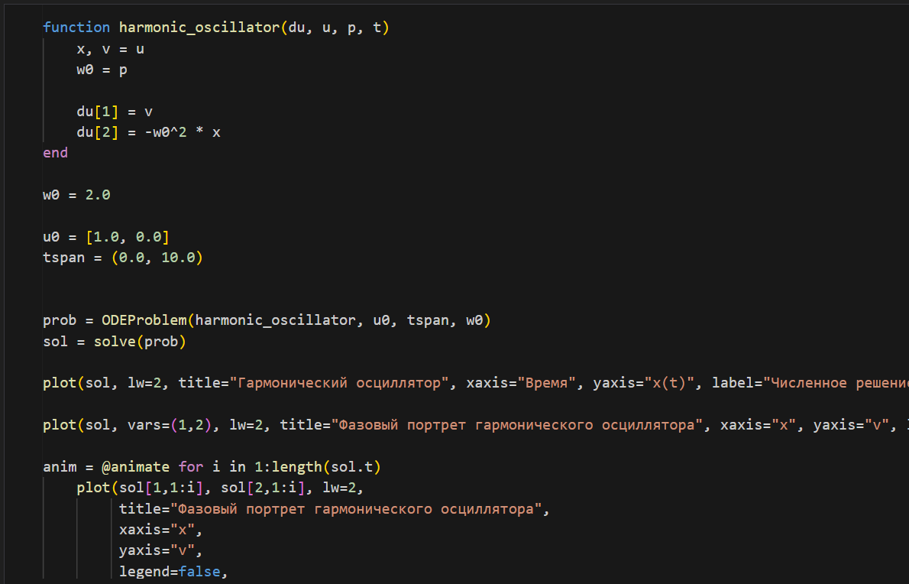
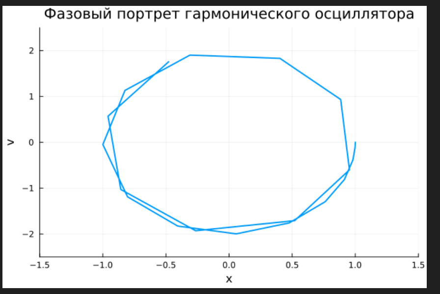

8. Реализуем на языке Julia модель свободных колебаний гармонического осциллятора:

$$
\ddot x + 2\gamma \dot x + \omega _0 ^2 = 0, x(t_0) = x_0, \dot x(t_0) = y_0.
$$

Построим соответствующие графики (в том числе с анимацией) и фазовый портрет
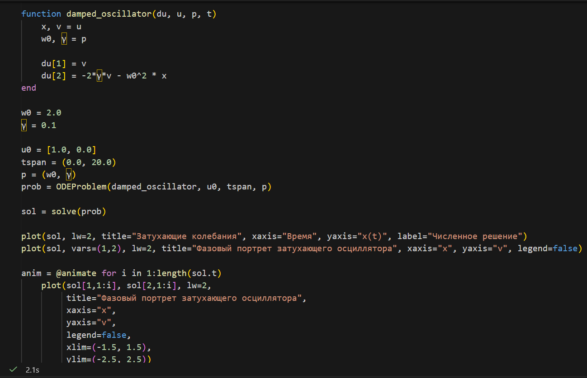
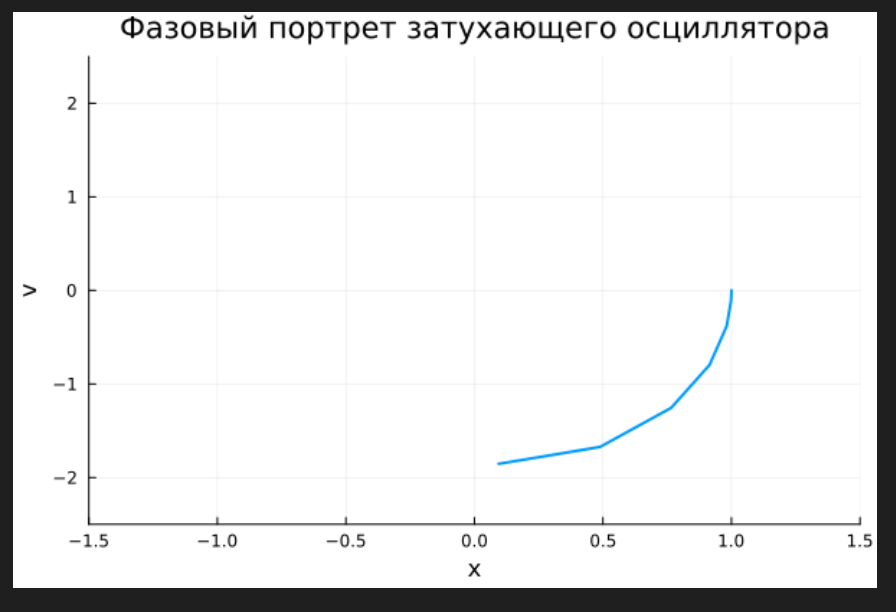

# Выводы

В результате выполнения данной лабораторной работы я освоил специализированные пакеты для решения задач в непрерывном и дискретном времени.