# Цель работы

Основной целью работы является освоение специализированных пакетов Julia для обработки данных

---

# Задание

1. Используя JupyterLab, повторите примеры, дополнив графики обозначениями осей координат, легендой и названиями графиков  
2. Выполните задания для самостоятельной работы

---

# Теоретическое введение

Julia — высокоуровневый язык программирования с динамической типизацией для математических вычислений.  
Эффективен для программ общего назначения.  
Использовалась официальная документация Julia.

# Задание №1 — Кластеризация

Загрузим данные Iris и построим диаграммы кластеров
```julia
using RDatasets
iris = dataset("datasets", "iris")
```

---

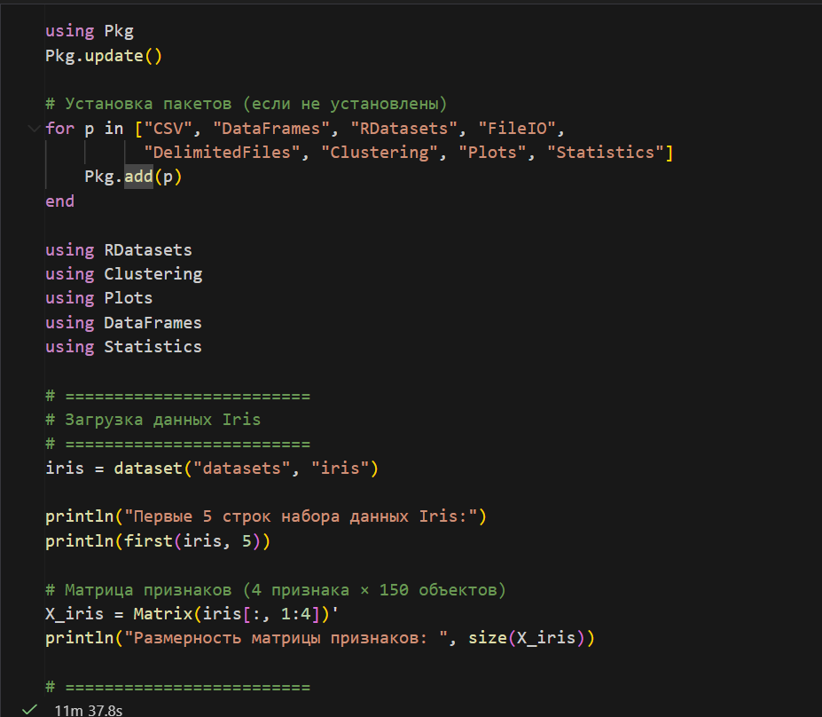

---

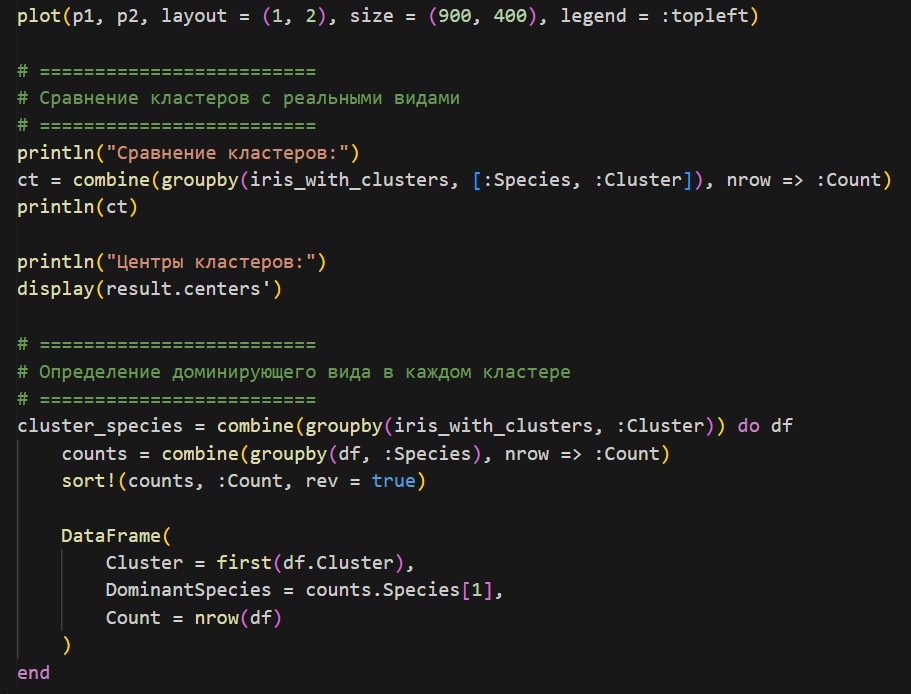

---

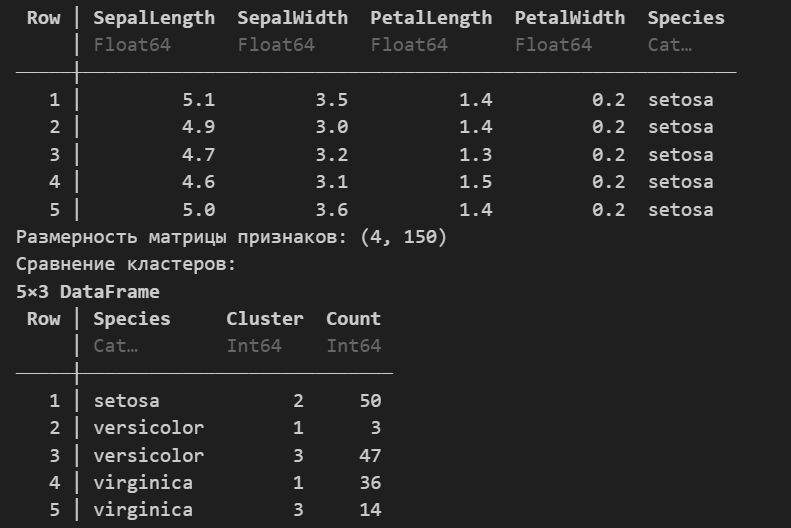

---

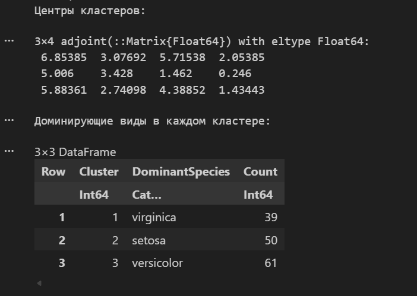

---

# Задание №2 — Линейная регрессия

Матрица наблюдений факторов размером N на 3, массив результатов размером N на 1. Найдем МНК-оценку для линейной модели  

- Сравним с функцией llsq из MultivariateStats  
- Сравним с использованием регулярной регрессии наименьших квадратов из GLM  

Создадим матрицу данных с добавленным столбцом единиц и решим систему линейных уравнений

---

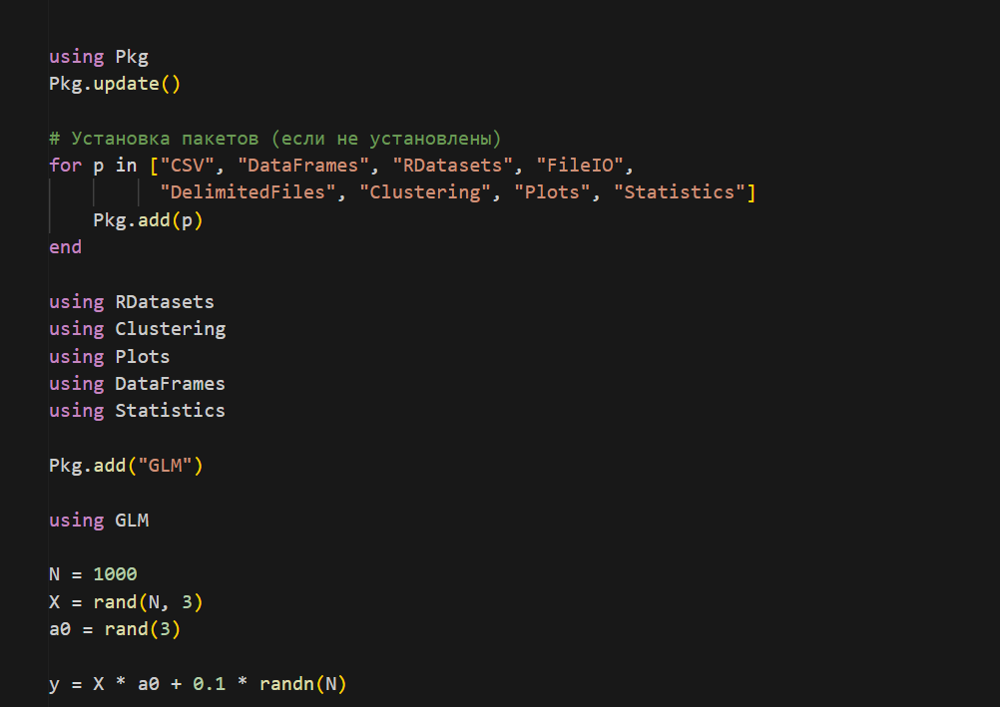

---

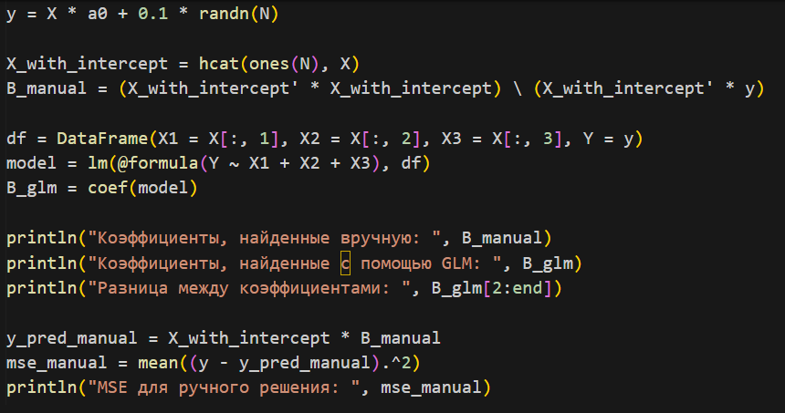

---

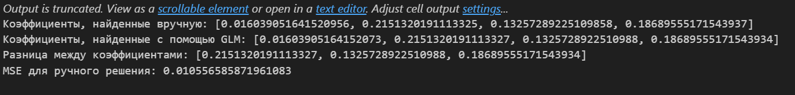

---

Найдем линию регрессии и построим график с заголовком и подписями осей

---

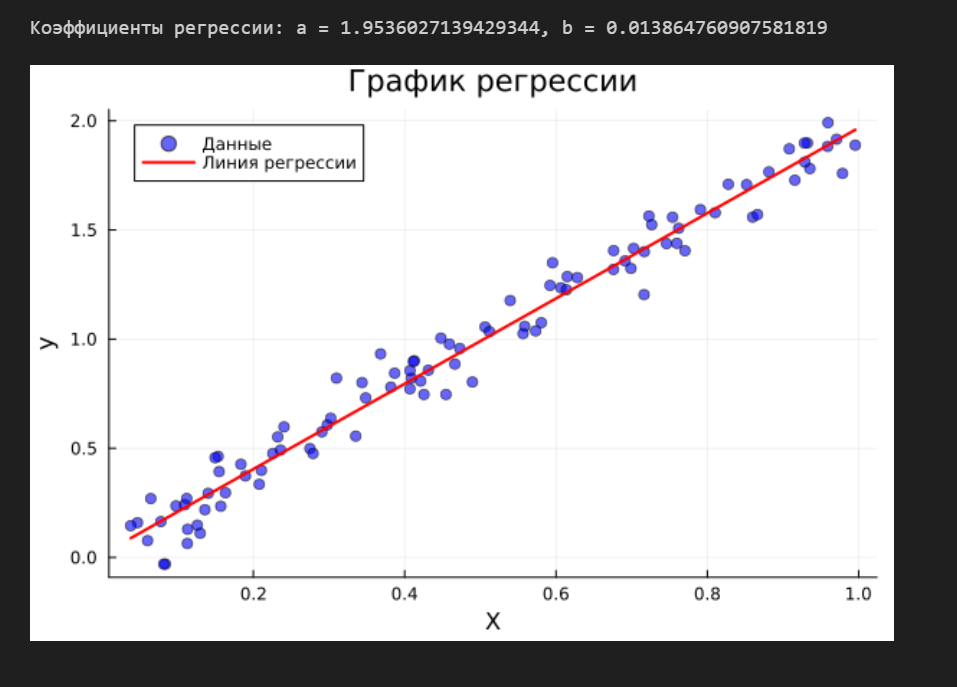

---

# Задание №3 — Модель ценообразования опционов

Построим траекторию возможных цен на акции с учетом начальных параметров  

---

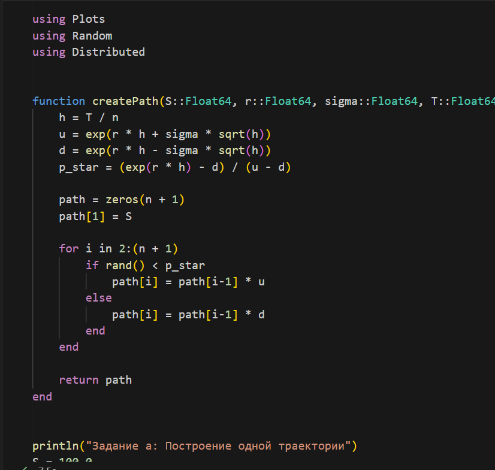

---

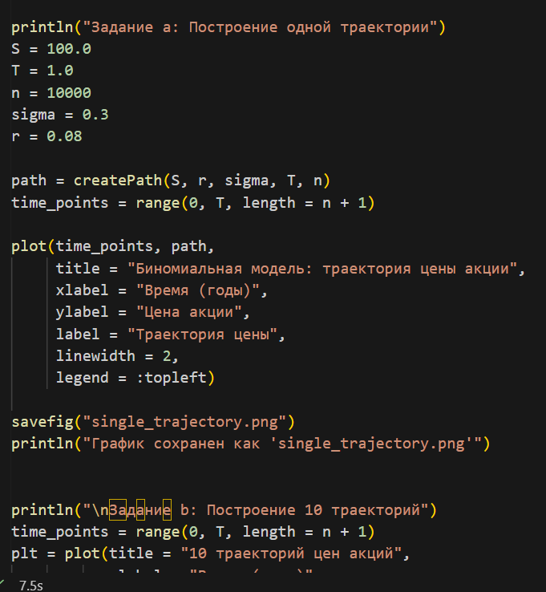

---

Создадим функцию createPath для генерации траектории цены акции. Построим 10 разных траекторий на одном графике

---

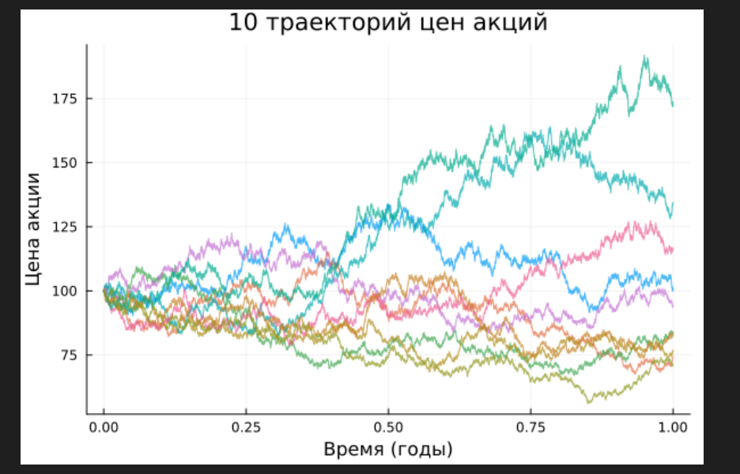

---

Распараллелим генерацию траектории с использованием потоков и параллельных вычислений

---


---

# Выводы

- Освоены специализированные пакеты Julia для обработки данных  
- Построены графики кластеризации, регрессии и финансовых моделей  
- Получены навыки анализа и визуализации динамических систем

