# Цель работы

Основная цель работа — освоить пакеты Julia для решения задач оптимизации.

# Задание
1. Используя Jupyter Lab, повторите примеры из раздела 8.2. 
2. Выполните задания для самостоятельной работы (раздел 8.4).

# Выполнение лабораторной работы
## Выполнение задания для самостоятельной работы
Линейное программирование

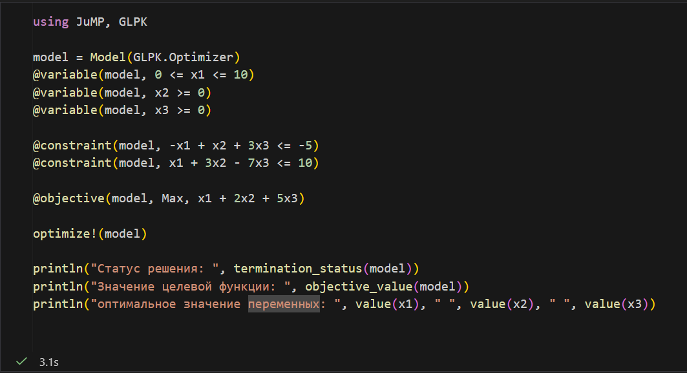
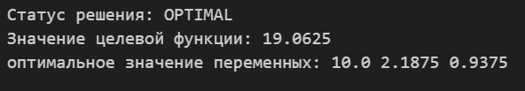

Линейное программирование. Использование массивов

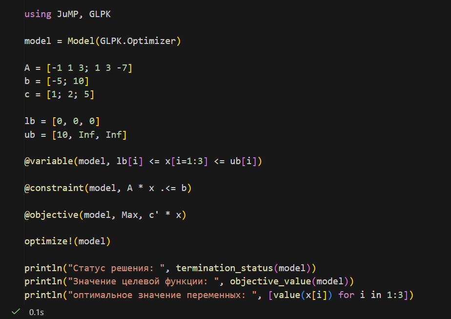
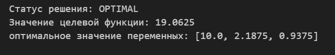

Выпуклое программирование
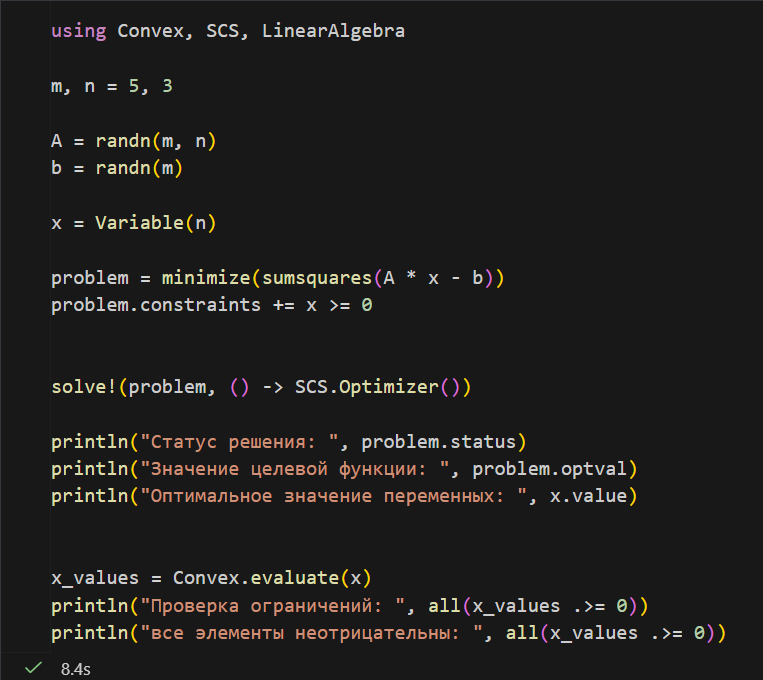
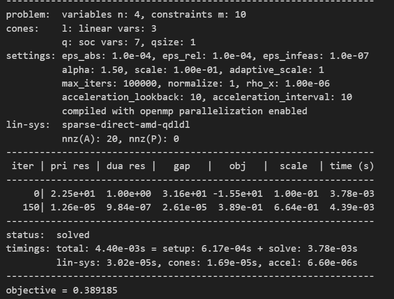

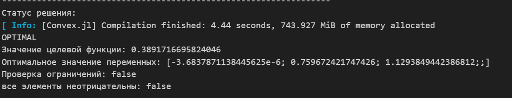

Оптимальная рассадка по залам
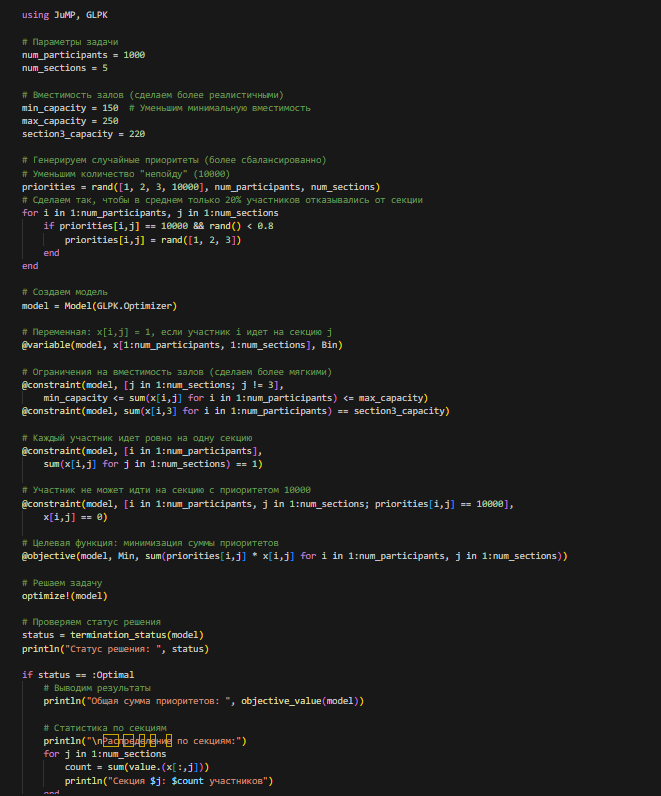

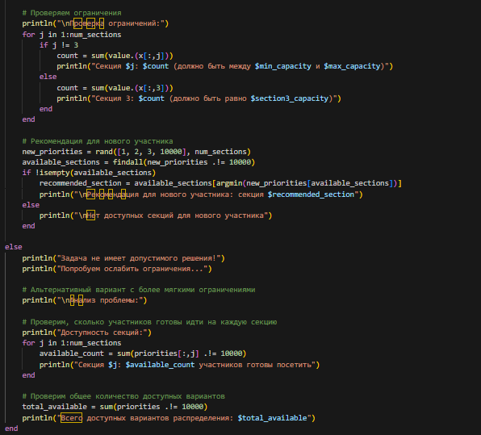
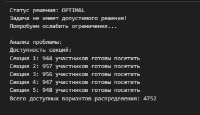

План приготовления кофе

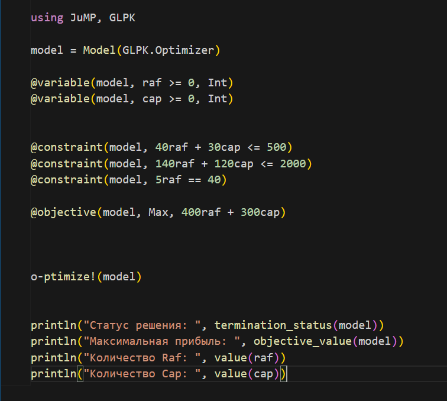
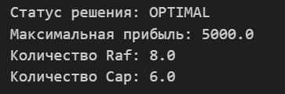
